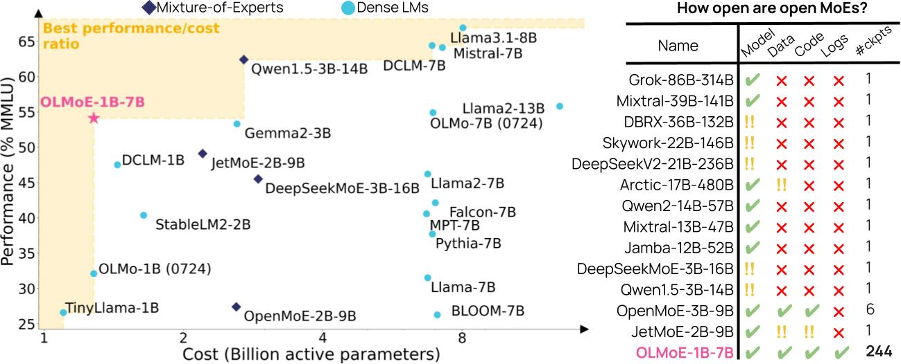

<div align="center">
  
  <h1>OLMoE: Open Mixture-of-Experts Language Models</h1>
  <p>Fully open, state-of-the-art Mixture of Expert model with 1.3 billion active and 6.9 billion total parameters. All data, code, and logs released. </p>
</div>
<br>



This repository provides an overview of all resources for the paper ["OLMoE: Open Mixture-of-Experts Language Models"](https://arxiv.org/abs/TODO).

- [Artifacts](#artifacts)
- [Inference](#inference)
- [Pretraining](#pretraining)
- [Adaptation](#adaptation)
- [Evaluation](#evaluation)
    - [During pretraining](#during-pretraining)
    - [After pretraining](#after-pretraining)
    - [After adaptation](#after-adaptation)
- [Visuals](#visuals)
- [Citation](#citation)

### Artifacts

- [Pretraining checkpoints](https://hf.co/allenai/OLMoE-1B-7B-0924)
- [Pretraining code](https://github.com/allenai/OLMo/tree/Muennighoff/MoE)
- [Pretraining data](https://huggingface.co/datasets/allenai/OLMoE-mix-0924)
- Pretraining logs: *coming soon*
- [SFT/DPO code](https://github.com/allenai/open-instruct/tree/olmoe-sft)
- [SFT checkpoints](https://huggingface.co/allenai/OLMoE-1B-7B-0924-SFT)
- [SFT data](https://hf.co/datasets/allenai/tulu-v3.1-mix-preview-4096-OLMoE)
- SFT logs: `logs/olmoe-sft-logs.txt`
- [DPO/KTO checkpoints](https://huggingface.co/allenai/OLMoE-1B-7B-0924-Instruct)
- [Preference (DPO/KTO) data](https://hf.co/datasets/allenai/ultrafeedback_binarized_cleaned)
- DPO logs: `logs/olmoe-dpo-logs.txt`

### Inference

Install the `transformers` & `torch` libraries and run:

```python
from transformers import OlmoeForCausalLM, AutoTokenizer
import torch

DEVICE = "cuda" if torch.cuda.is_available() else "cpu"

# Load different ckpts via passing e.g. `revision=step10000-tokens41B`
# also check allenai/OLMoE-1B-7B-0924-SFT & allenai/OLMoE-1B-7B-0924-Instruct
model = OlmoeForCausalLM.from_pretrained("allenai/OLMoE-1B-7B-0924").to(DEVICE)
tokenizer = AutoTokenizer.from_pretrained("allenai/OLMoE-1B-7B-0924")
inputs = tokenizer("Bitcoin is", return_tensors="pt")
inputs = {k: v.to(DEVICE) for k, v in inputs.items()}
out = model.generate(**inputs, max_length=64)
print(tokenizer.decode(out[0]))
# > # Bitcoin is a digital currency that is created and held electronically. No one controls it. Bitcoins aren’t printed, like dollars or euros – they’re produced by people and businesses running computers all around the world, using software that solves mathematical
```

You can list all revisions/branches by installing `huggingface-hub` & running:
```python
from huggingface_hub import list_repo_refs
out = list_repo_refs("allenai/OLMoE-1B-7B-0924")
branches = [b.name for b in out.branches]
```

### Pretraining

1. Clone this [OLMo branch](https://github.com/allenai/OLMo/tree/Muennighoff/MoE) & create an environment with its dependencies via `cd OLMo; pip install -e .`. If you want to use new features in OLMo clone from the `main` branch instead.
2. Run `pip install git+https://github.com/Muennighoff/megablocks.git@olmoe`
3. Setup a config file. `configs/OLMoE-1B-7B-0924.yml` was used for the pretraining of `OLMoE-1B-7B-0924`. You can find configs from various ablations in `configs/ablations`.
4. Download the data from https://hf.co/datasets/allenai/OLMoE-mix-0924, tokenize it via the command below and adapt the `paths` in your training config to point to it.
```bash
dolma tokens \
--documents ${PATH_TO_DOWNLOADED_DATA} \
--destination ${PATH_WHERE_TO_SAVE_TOKENIZED_DATA} \
--tokenizer.name_or_path 'allenai/gpt-neox-olmo-dolma-v1_5' \
--max_size '2_147_483_648' \
--seed 0 \
--tokenizer.eos_token_id 50279 \
--tokenizer.pad_token_id 1 \
--processes ${NUMBER_OF_CPU_CORES_TO_USE}
```
6. Submit your job. We used `bash scripts/olmoe-gantry.sh` which invokes https://github.com/allenai/OLMo/blob/Muennighoff/MoE/scripts/train.py and uses [beaker gantry](https://github.com/allenai/beaker-gantry) but you will likely need to change the script to work with your setup.

### Adaptation

1. Clone this [open-instruct branch](https://github.com/allenai/open-instruct/tree/olmoe-sft) & follow its setup instructions. If you want to use new features in open-instruct clone from the `main` branch instead.
2. SFT: Run
```
accelerate launch \
--mixed_precision bf16 \
--num_machines 1 \
--num_processes 8 \
--use_deepspeed \
--deepspeed_config_file configs/ds_configs/stage3_no_offloading_accelerate.conf \
open_instruct/finetune.py \
--model_name_or_path allenai/OLMoE-1B-7B-0924 \
--tokenizer_name allenai/OLMoE-1B-7B-0924 \
--use_slow_tokenizer \
--use_flash_attn \
--max_seq_length 4096 \
--preprocessing_num_workers 128 \
--per_device_train_batch_size 2 \
--gradient_accumulation_steps 8 \
--learning_rate 2e-05 \
--lr_scheduler_type linear \
--warmup_ratio 0.03 \
--weight_decay 0.0 \
--num_train_epochs 2 \
--output_dir output/ \
--with_tracking \
--report_to wandb \
--logging_steps 1 \
--reduce_loss sum \
--model_revision main \
--dataset_mixer_list allenai/tulu-v3-mix-preview-4096-OLMoE 1.0 ai2-adapt-dev/daring-anteater-specialized 1.0 \
--checkpointing_steps epoch \
--add_bos
```
4. DPO: Run
```
accelerate launch \
--mixed_precision bf16 \
--num_machines 1 \
--num_processes 8 \
--use_deepspeed \
--deepspeed_config_file configs/ds_configs/stage3_no_offloading_accelerate.conf \
open_instruct/dpo_tune.py \
--model_name_or_path allenai/OLMoE-1B-7B-0924-SFT \
--tokenizer_name allenai/OLMoE-1B-7B-0924-SFT \
--use_flash_attn \
--gradient_checkpointing \
--dataset_name argilla/ultrafeedback-binarized-preferences-cleaned \
--max_seq_length 4096 \
--preprocessing_num_workers 16 \
--per_device_train_batch_size 1 \
--gradient_accumulation_steps 4 \
--learning_rate 5e-7 \
--lr_scheduler_type linear \
--warmup_ratio 0.1 \
--weight_decay 0. \
--num_train_epochs 3 \
--output_dir output/ \
--report_to tensorboard \
--logging_steps 1 \
--reduce_loss sum \
--add_bos \
--checkpointing_steps epoch \
--dpo_beta 0.1
```
6. KTO: Install `trl` and run https://github.com/Muennighoff/kto/blob/master/kto.py via `WANDB_PROJECT=olmoe accelerate launch --config_file=config_8gpusdsz2_m7.yml kto.py --model_name_or_path allenai/OLMoE-1B-7B-0924-SFT --output_dir OLMoE-1B-7B-0924-SFT-KTO-3EP --report_to "wandb" --per_device_train_batch_size 4 --gradient_accumulation_steps 1 --optim rmsprop --learning_rate 5e-07 --beta 0.1 --logging_steps 1 --bf16 --sanity_check False --num_train_epochs 3` (if you want to run the Adam optimizer change to `--optim adamw_torch`). We used `trl==0.9.6`.

### Evaluation

#### During pretraining

Evaluation during pretraining is done automatically and configured in the config file. It uses the code here: https://github.com/allenai/OLMo/tree/Muennighoff/MoE/olmo/eval.

#### After pretraining

OLMES Evals: Follow the instructions at https://github.com/allenai/OLMo-Eval/blob/51c5ba579e75ef4ce7e9b29936eaa72c1a0e99eb/olmo_eval/tasks/olmes_v0_1/README.md

DCLM Evals: Run `scripts/run_dclm_evals*` and refer to instructions from https://github.com/mlfoundations/dclm

#### After adaptation

- Setup https://github.com/allenai/open-instruct/tree/olmoe-sft
- Run `sbatch scripts/adapteval.sh` after changing it as necessary / extract the commands from the script and run them one by one.

### Visuals

- All visuals are created either manually or via `scripts/olmoe_visuals.ipynb` equivalent to [this colab](https://colab.research.google.com/drive/15PTwmoxcbrwWKG6ErY44hlJlLLKAj7Hx?usp=sharing) except for:
- Figure 1, `visuals/figures/overview.pdf`: Run "Main plot" in `scripts/olmoe_visuals.ipynb` equivalent to [this colab](https://colab.research.google.com/drive/15PTwmoxcbrwWKG6ErY44hlJlLLKAj7Hx?usp=sharing) and add the result into this drawing to edit it further: https://docs.google.com/drawings/d/1Of9-IgvKH54zhKI_M4x5HOYEF4XUp6qaXluT3Zmv1vk/edit?usp=sharing
- Figure 2, `visuals/figures/olmoe.pdf`: https://www.figma.com/design/Es8UpNHKgugMAncPWnSDuK/olmoe?node-id=0-1&t=SeuQKPlaoB12TXqe-1
- Figure 3 & 25, `visuals/figures/trainingeval*pdf`: Run "During training" in `scripts/olmoe_visuals.ipynb` equivalent to [this colab](https://colab.research.google.com/drive/15PTwmoxcbrwWKG6ErY44hlJlLLKAj7Hx?usp=sharing) 
- Figure 4 - 19, 24, 26-29, `visuals/figures/...pdf`: Run respective parts in `scripts/olmoe_visuals.ipynb` equivalent to [this colab](https://colab.research.google.com/drive/15PTwmoxcbrwWKG6ErY44hlJlLLKAj7Hx?usp=sharing) 
- Figure 20, 21, 23, 30, 31, Table 8, `visuals/figures/...pdf`: `scripts/run_moe_analysis.py`
- Figure 22, 33-36 `visuals/figures/...pdf`: Run `scripts/run_routing_analysis.py` & then `scripts/plot_routing_analysis_v2.ipynb` / `scripts/plot_routing_analysis_v2_top1.ipynb` / `scripts/plot_routing_analysis_v2_cross_layer.ipynb`
- Figure 32, `visuals/figures/...pdf`: Run  `scripts/run_routing_analysis.py` & then `scripts/plot_routing_analysis.ipynb`
- Table 13: `scripts/make_table.py`
- All other tables are manually created.

### Citation

```bibtex
TODO
```
